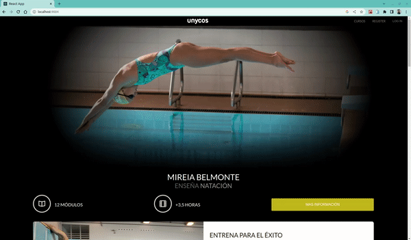

## **Bem-vindo ao repositório do projeto Unyco**

## Projeto Unyco
### Versão mobile

## Versão desktop

### Contexto
Neste projeto foi desenvolvido uma Landing Page de uma escola fictícia que oferece cursos online. É possível realizar login da aplicação, assim como ter uma visão superficial de um site com o front-end completo.

### Tecnologias utilizadas
Projeto desenvolvido utilizando React.js, CSS3, COntext API como gerenciador de esto global e hooks, além do consumo dinâmico de uma RestAPI (https://api.beta.unycos.com)

### Como utilizar a aplicação
- Dê um git clone no repositório do projeto;
- Entre na pasta raíz da aplicação, instale as dependências com npm install e inicie a aplicação com npm start;
- Na página de Login digite um e-mail válido. Ex: nome@domínio.com;
- Digite ainda uma senha com no mínimo 7 dígitos da sua preferência;
- Ou acesse o link do deploy <a href="https://unyco.vercel.app/">Aqui</a>

##### Observações:
###### Este projeto foi desenvolvido como etapa de desafio técnico da Coodesh para demonstração de competências necessárias para vaga de Desenvolvedora Front-end Jr.
